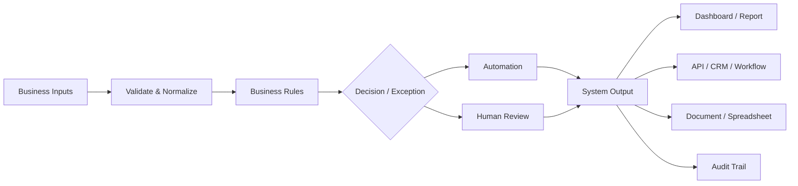

<div align="center">

# Lavonte Jones

### Business Systems • Workflow Automation • FP&A • Data & Integration

I build practical systems that help businesses organize information, automate repetitive work, improve reporting, and turn fragmented processes into reliable workflows.

My work sits at the intersection of **business operations, finance, automation, APIs, data transformation, and decision-support systems**.

<br>


</div>

---

## What I Build

I focus on business problems where information is spread across spreadsheets, forms, accounting systems, CRMs, documents, email workflows, or disconnected software.

Typical solutions include:

| Capability | Business Use |
|---|---|
| **Workflow Automation** | Remove repetitive manual steps, standardize processes, route work, and create review controls |
| **API & System Integration** | Move structured information between applications and create reliable system handoffs |
| **Financial Modeling & FP&A** | Forecast cash, model scenarios, compare actual performance with plans, and support management decisions |
| **KPI & Management Reporting** | Turn operating data into useful dashboards and recurring management reporting |
| **Data Reconciliation** | Compare records across systems, identify duplicates and conflicts, and create traceable master datasets |
| **Document Automation** | Generate consistent DOCX, PDF, XLSX, and HTML deliverables from structured information |
| **Business Process Design** | Translate an operating problem into rules, controls, exceptions, and an implementable workflow |

---

## Selected Systems

These repositories are functional portfolio projects built with synthetic data. They are designed to demonstrate the underlying engineering, business logic, validation, and implementation approach rather than simulated client results.

### Document Production Engine

**Structured information → controlled document generation → validation → finished deliverables**

[View repository →](https://github.com/lavontejones/document-engine)

A deterministic document-generation system that produces **DOCX, PDF, XLSX, and HTML** outputs from structured content and reusable design rules.

Demonstrates:

- multi-format document generation
- reusable document components
- spreadsheet formulas, tables, charts, and validation
- automated render and layout checks
- version-controlled output
- machine-readable build manifests
- document QA workflows

---

### Customer Data Reconciliation Engine

**CRM data + accounting data → identity resolution → customer master → review queue**

[View repository →](https://github.com/lavontejones/customer-data-reconciliation-engine)

A production-style reconciliation engine built around **1,000 synthetic CRM records and 1,000 synthetic accounting records**.

The system validates, normalizes, compares, matches, and reconciles customer records while preserving source evidence and uncertain cases for human review.

Demonstrates:

- data validation and profiling
- duplicate detection
- deterministic and fuzzy matching
- conflict resolution
- confidence scoring
- human-review routing
- data lineage
- audit trails
- reproducible outputs
- automated testing

---

### API Integration Demo

**Inbound request → validation → routing → storage → CRM-ready payload → webhook**

[View repository →](https://github.com/lavontejones/api-integration-demo)

A working reference implementation of a small-business intake and integration system.

It accepts structured requests, validates and normalizes data, detects duplicates, applies routing logic, persists records, produces CRM-ready output, sends local webhook events, and maintains an audit trail.

Demonstrates:

- REST APIs
- structured data validation
- business-rule engines
- duplicate handling
- SQLite persistence
- webhook delivery
- bounded retry logic
- authentication patterns
- logging and auditing
- integration testing

---

### Cash Flow Forecasting

**Business assumptions → scenarios → monthly operating forecast → cash outlook**

[View repository →](https://github.com/lavontejones/cash-flow-forecasting)

A functional FP&A system for building operating scenarios and tracing business assumptions through revenue, collections, expenses, and ending cash.

Demonstrates:

- base, downside, upside, and custom scenarios
- cash forecasting
- operating break-even analysis
- runway calculations
- management reporting
- CSV exports
- HTML reports
- reproducible financial calculations
- automated validation

---

### Executive KPI Dashboard

**Operating data → business metrics → management dashboard**

[View repository →](https://github.com/lavontejones/kpi-dashboard)

A management-reporting dashboard built around a fictional service business.

The dashboard converts synthetic operating data into financial, pipeline, cash, and workforce metrics.

Demonstrates:

- KPI design
- financial and operational reporting
- scenario analysis
- interactive filtering
- data visualization
- synthetic data generation
- Streamlit application development
- automated testing

---

### n8n Automation Workflows

**Business event → validation → business rules → decision → controlled output**

[View repository →](https://github.com/lavontejones/n8n-workflows)

A collection of synthetic n8n workflow demonstrations covering common small-business operating processes.

Current examples include:

- lead intake and scoring
- weekly KPI reporting
- invoice follow-up logic
- CRM duplicate detection
- operations health monitoring

The workflows are intentionally separated from live credentials and production systems so their decision logic can be inspected safely.

---

### FP&A Toolkit

**Budget + actuals → variance analysis → forecast → management report**

[View repository →](https://github.com/lavontejones/fpa-toolkit)

A lightweight management-planning toolkit for comparing budget and actual performance and producing a driver-based 12-month cash outlook.

Demonstrates:

- budget versus actual analysis
- favorable/unfavorable variance logic
- driver-based forecasting
- scenario assumptions
- management reporting
- deterministic financial calculations

---

## How the Systems Fit Together



The technology is only one layer.

The larger objective is to build a system that answers five questions:

1. **What enters the process?**
2. **What rules should apply?**
3. **What can happen automatically?**
4. **What requires human judgment?**
5. **How can the result be verified later?**

---

## Business Problems I Am Interested In

I am particularly interested in projects involving:

- repetitive administrative workflows
- spreadsheet-heavy operating processes
- fragmented customer or financial data
- manual reporting
- CRM cleanup and migration preparation
- lead intake and routing
- document-heavy workflows
- system-to-system data movement
- financial planning and forecasting
- recurring management reporting
- process standardization
- exception and approval workflows
- internal business tools

---

## Technical Approach

My preferred architecture is deliberately practical:

```text
Input
  ↓
Validation
  ↓
Normalization
  ↓
Business Rules
  ↓
Automation
  ↓
Exception Handling
  ↓
Output
  ↓
Validation / Audit
```

I favor systems that are:

**Understandable**  
A business user should be able to understand what the system is doing.

**Testable**  
Important rules should be independently verifiable.

**Traceable**  
The system should preserve enough evidence to explain how an output was produced.

**Controlled**  
Automation should distinguish between deterministic actions and decisions that require human review.

**Maintainable**  
Logic should not depend on one person remembering undocumented steps.

**Adaptable**  
Business rules, thresholds, mappings, and assumptions should be configurable when practical.

---

## Tools & Technologies

### Automation & Integration

`n8n` • `REST APIs` • `Webhooks` • `JSON` • `CSV` • `HTTP`

### Development & Data

`Python` • `SQL` • `SQLite` • `Pandas` • `Git` • `GitHub`

### Financial & Analytical

`Excel` • `FP&A` • `Financial Modeling` • `Scenario Analysis` • `KPI Design`

### Applications & Reporting

`Streamlit` • `HTML` • `XLSX` • `DOCX` • `PDF`

### Quality & Delivery

`GitHub Actions` • `Automated Testing` • `Validation` • `Audit Trails` • `Synthetic Test Data`

---

## What the Portfolio Is Designed to Demonstrate

This portfolio is not intended to show isolated coding exercises.

The projects are designed to demonstrate the ability to move through the complete problem:

```text
Business Problem
      ↓
Process Analysis
      ↓
Data / System Design
      ↓
Business Rules
      ↓
Implementation
      ↓
Testing
      ↓
Business-Facing Output
```

That distinction matters.

A technically functional script is useful.

A system that is **technically functional, understandable to the business, tested, auditable, and designed around the actual operating problem** is substantially more valuable.

---

## Portfolio Principles

All public demonstrations use synthetic or fictional data.

Public repositories are intentionally separated from:

- client information
- private business records
- production credentials
- confidential financial information
- live customer systems

Where a repository models a production workflow, the documentation identifies the controls that would still be required before real deployment.

---

<div align="center">

### Selected Portfolio

[Document Engine](https://github.com/lavontejones/document-engine) ·
[Data Reconciliation](https://github.com/lavontejones/customer-data-reconciliation-engine) ·
[API Integration](https://github.com/lavontejones/api-integration-demo) ·
[Cash Flow Forecasting](https://github.com/lavontejones/cash-flow-forecasting) ·
[KPI Dashboard](https://github.com/lavontejones/kpi-dashboard) ·
[n8n Workflows](https://github.com/lavontejones/n8n-workflows)

</div>
